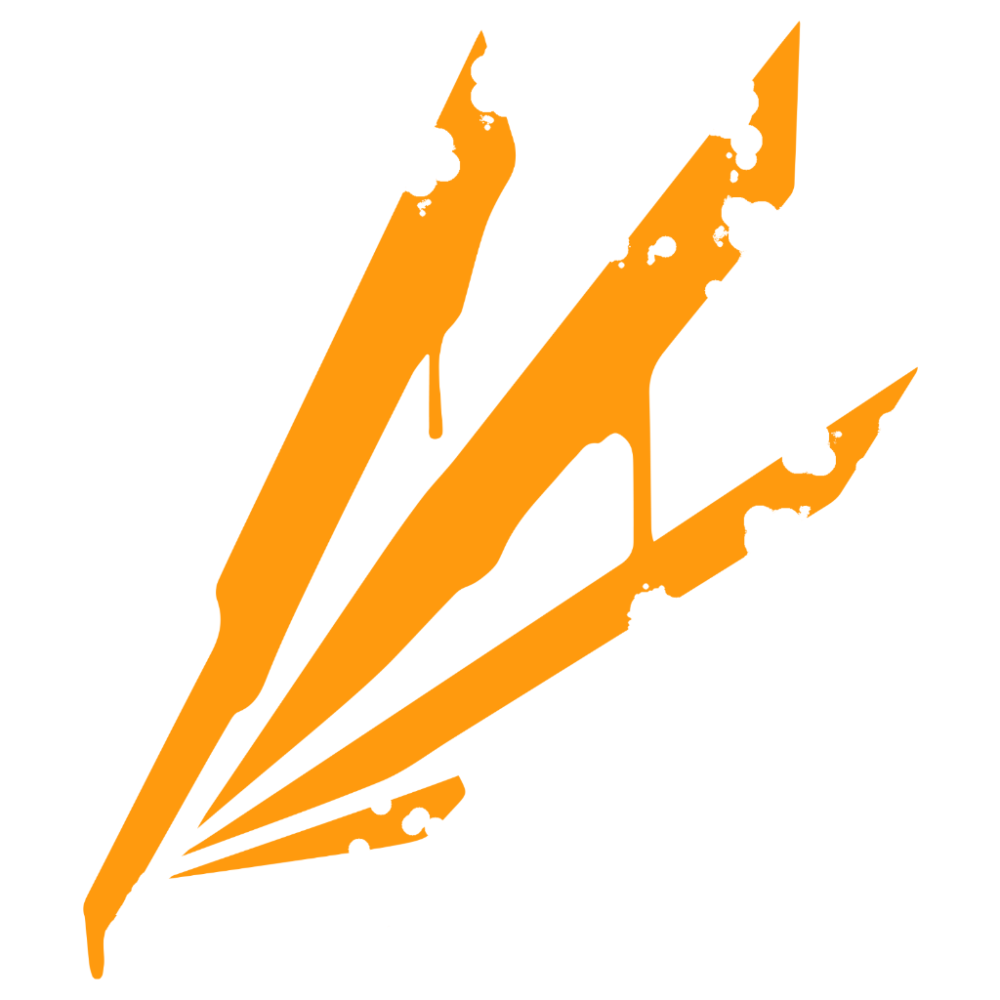

# 欢迎

[锈蚀伊始之地](nouns/xiu-shi-yi-shi-zhi-di.md)Rusmatic(锈羽派)是基于[Avali](https://avali.fandom.com/)的一个二次创作的文化背景以及一系列设定集合, 其唯一作者为Tunanodra. 在此特别鸣谢DeepDeoTechDragons Industry对本项目的支持

Rusmatic(锈羽派)遵守Avali Wiki中对于[Independent Worlds](https://avali.fandom.com/wiki/Factions#Independent\_Worlds)的设定, 是一个独立的世界, 并且其起源中也已经明确提到了设定等, 更多请参考章节[LICENSE](nouns/license.md).

Rusmatic是一个包容开放的文化, 拥有大量的内容.

您可以随时回到这个页面来查看内容, 文中的链接会解释一些特定的名词, 同时你也可以在名词解释中找到对应的页面

<figure><figcaption>
Rusmatic(锈羽派)的徽耀
</figcaption></figure>

_"他的羽翼在炙热的光辉中融化，化作一滴滴金色的泪珠，洒落于无垠的星空"_&#x20;

