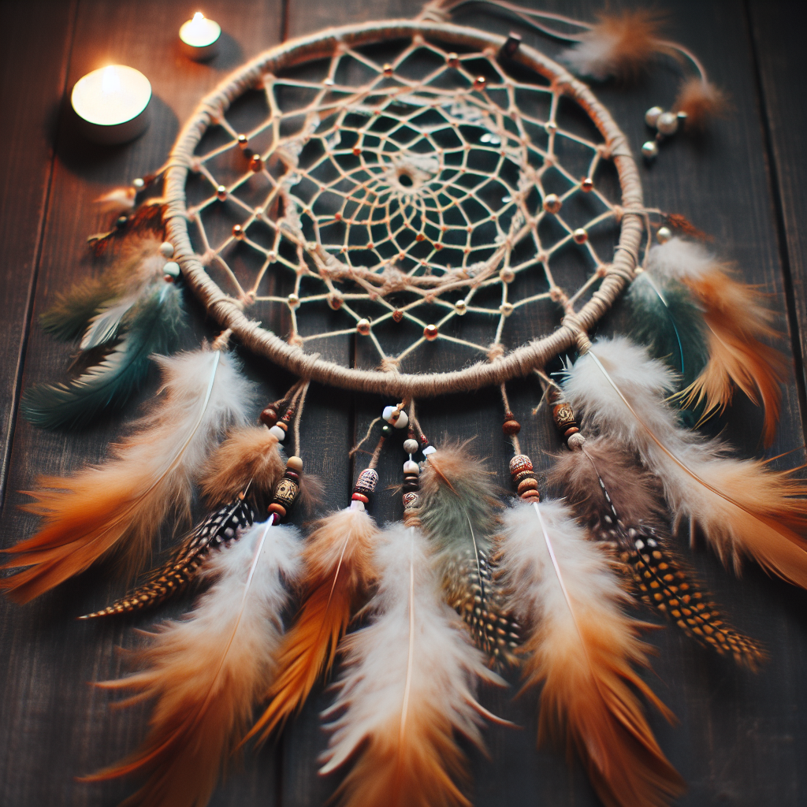

# 捕梦网

一种传统的装饰品, 相传可以捕获噩梦, 保护使用者的梦境, 锈羽文化中捕梦网会守护他们的平安, 同时也是一切安好的象征, 锈羽通常使用自己的羽毛装饰自己的捕梦网, 挂在自己家门口则可以带来好运, 若是挂在了八角塔的底下, 则证明该捕梦网的主人已经离世

<figure><figcaption>
Powered By DALLE3
</figcaption></figure>

一个典型的捕梦网, 使用纤维和活茎制作, 装饰有羽毛
